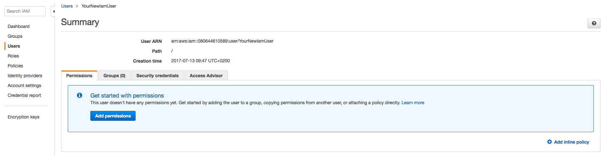
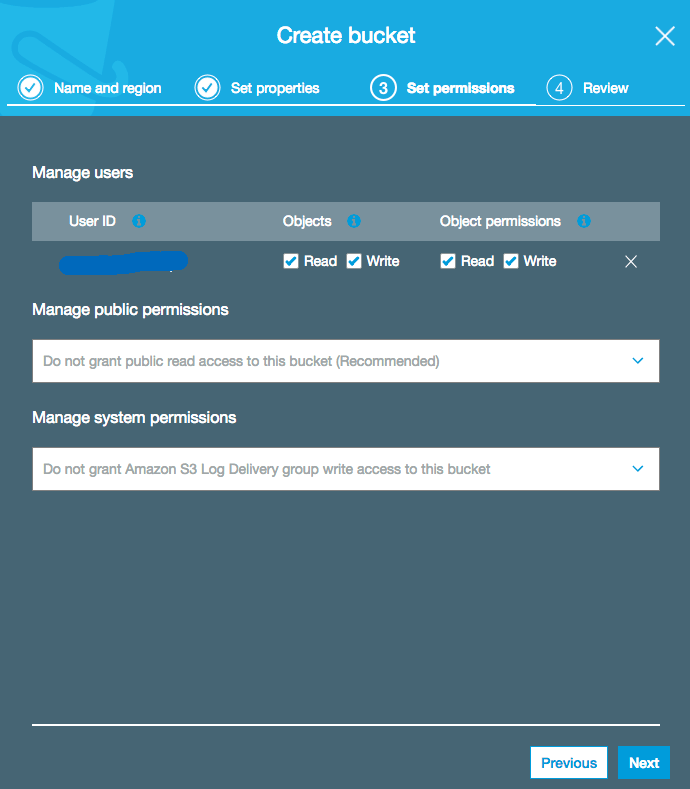

Deployment
==========

.. _Heroku.com: https://www.heroku.com/
.. _aws.amazon.com: https://aws.amazon.com/

Heroku
------

Requirements for Heroku.com Hosting
^^^^^^^^^^^^^^^^^^^^^^^^^^^^^^^^^^^

1. An Account on `Heroku.com`_
2. An Account on `aws.amazon.com`_
3. For the Static & Media Files a S3 Bucket on `aws.amazon.com`_

.. _createNewIamUser:

Create a new IAM User for aws
^^^^^^^^^^^^^^^^^^^^^^^^^^^^^

Go on `create new IAM user`_ to create a new IAM User for your S3 Bucket.

At first enter a `User name`` and activate ``Programmatic access`` and than on ``Next: Permission`` button.

On the next page ``Set permissions for YourNewIamUser`` just click on ``Next: Review`` without to add any group or policies.

.. figure:: _static/img/aws/iam/iam-create-02.png
    :target: _static/img/aws/iam/iam-create-02.png

On Review ignore the warning ``This user has no permissions`` and click on ``Create User``.

.. figure:: _static/img/aws/iam/iam-create-03.png
    :target: _static/img/aws/iam/iam-create-03.png

On the last page write down your new ``Access key ID`` & ``Secret access key`` to use it later on the deployment. And in
the end click on ``Close``

.. figure:: _static/img/aws/iam/iam-create-04.png
    :target: _static/img/aws/iam/iam-create-04.png

Now get the User ARN, for that click on your new created user.

.. figure:: _static/img/aws/iam/iam-create-05.png
    :target: _static/img/aws/iam/iam-create-05.png

In the Summary page you will see the user ARN, also write it down for using to setup your S3 Bucket.

.. _create new IAM user: https://console.aws.amazon.com/iam/home#/users$new?step=details

.. _SetupAS3Bucket:

Setup a S3 Bucket
^^^^^^^^^^^^^^^^^

To create a S3 Bucket for the media & static files go on `create new S3 Bucket`_ and click on ``+ Create bucket``.

.. figure:: _static/img/aws/S3/s3-create-01.png
    :target: _static/img/aws/S3/s3-create-01.png

In the following wizard enter your ``Bucket name`` and select your ``Region`` than click on ``Next``.

On the next page 'Set properties' just click on ``Next``.

And again on 'Set permission' just click on ``Next``.

For the last time 'Review' just click on ``Create Bucket``.

.. figure:: _static/img/aws/S3/s3-create-05.png
    :target: _static/img/aws/S3/s3-create-05.png

So after the Bucket is created click on your new Bucket in the list and  on the right side click on ``Permissions``.

.. figure:: _static/img/aws/S3/s3-create-06.png
    :target: _static/img/aws/S3/s3-create-06.png

At next click on ``Bucket Policy`` and write down the following policy.

**Importent** change ``BUCKET-NAME`` with your Bucket name and ``USER-ARN`` with your just befor created user.

.. code-block:: json

    {
        "Version": "2008-10-17",
        "Statement": [
            {
                "Sid": "PublicReadForGetBucketObjects",
                "Effect": "Allow",
                "Principal": {
                    "AWS": "*"
                },
                "Action": "s3:GetObject",
                "Resource": "arn:aws:s3:::BUCKET-NAME/*"
            },
            {
                "Effect": "Allow",
                "Principal": {
                    "AWS": "USER-ARN"
                },
                "Action": "s3:*",
                "Resource": [
                    "arn:aws:s3:::BUCKET-NAME",
                    "arn:aws:s3:::BUCKET-NAME/*"
                ]
            }
        ]
    }

Policy by Wagtail.io: `Wagtail.io Blog - Amazon S3`_

.. figure:: _static/img/aws/S3/s3-create-06.png
    :target: _static/img/aws/S3/s3-create-06.png

.. _create new S3 Bucket: https://console.aws.amazon.com/s3/home

.. _Wagtail.io Blog - Amazon S3: https://wagtail.io/blog/amazon-s3-for-media-files/

Deploy to Heroku.com
^^^^^^^^^^^^^^^^^^^^

For easy deployment click on the Heroku Deployment Button, there you will see a pre configured heroku app.

The ``App Name (optional)`` and ``Runtime Selection`` you can change as you like but in the ``Config Variables`` section
you have to change the ``SECRET_KEY`` to something new (you can use `Django Secret Key Generator`_) and
``AWS_STORAGE_BUCKET_NAME``, ``AWS_ACCESS_KEY_ID`` & ``AWS SECRET ACCESS KEY`` you have to insert your just created values
from :ref:`createNewIamUser` & :ref:`SetupAS3Bucket`

.. _Django Secret Key Generator: http://www.miniwebtool.com/django-secret-key-generator/

.. figure:: https://www.herokucdn.com/deploy/button.png
    :target: https://heroku.com/deploy?template=https://github.com/linuxluigi/linuxluigi.com

.. figure:: _static/img/heroku/deployment-01.png
    :target: _static/img/heroku/deployment-01.png
